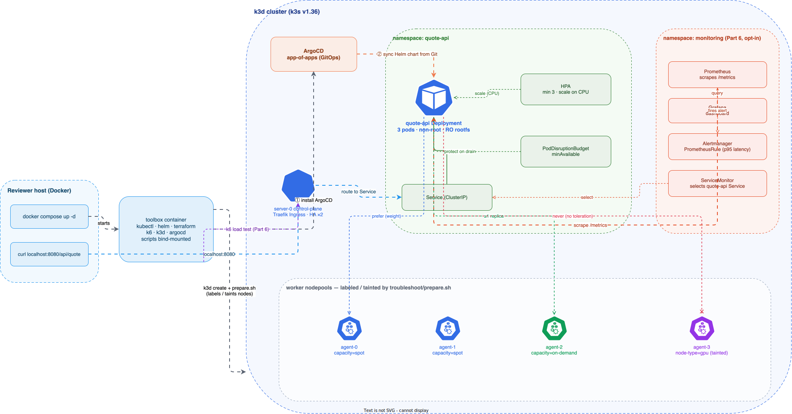
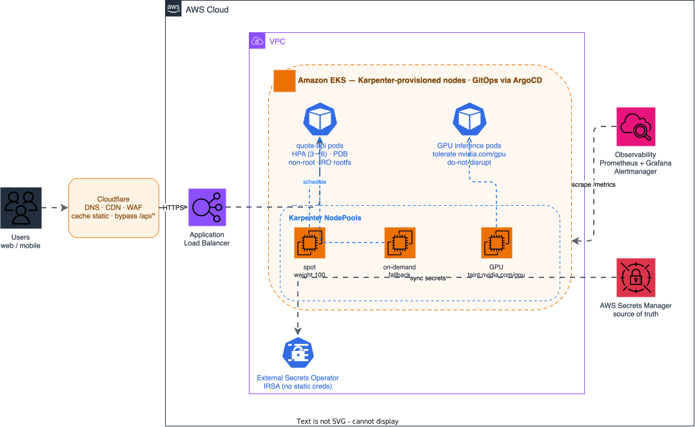

# quote-api — DevOps Take-Home

[](https://github.com/tan-demo/demo-devops/actions/workflows/ci.yml)

A small HTTP quote API, shipped GitOps-style (ArgoCD) onto a local multi-node k3d cluster that
simulates a mixed **spot / on-demand / GPU** nodepool environment.

- **Public image:** `ghcr.io/tan-demo/quote-api` (tagged by git SHA)
- Everything runs locally in Docker — no cloud account needed.

---

## Quick start (the Golden Rule)

**Only prerequisite on the host: Docker with the Compose v2 plugin** (Docker Desktop ships both).
Everything else — kubectl, helm, terraform, k6, k3d, argocd — lives inside the toolbox image.

The host scripts source a **preflight** (`scripts/_preflight.sh`) that detects the OS (`uname`),
auto-installs anything missing where it's safe (the Compose v2 plugin user-local; Docker via
`get.docker.com`/`brew --cask`), starts the daemon if it's down, and otherwise prints the install
command — so a missing dependency never surfaces as a cryptic mid-run error. `PREFLIGHT_AUTO_INSTALL=0`
makes it check-only. If everything is present it just continues. It then verifies the toolbox image
actually carries the in-cluster tools (kubectl/helm/terraform/k6/k3d/argocd) and, if not, tells you to
rebuild it — those live in the image, not on the host.

Targets macOS / Linux (the Golden Rule's shell). On Windows, run it from **WSL2** — that's Linux, and
Docker Desktop's WSL2 backend exposes `docker` there.

```bash
git clone https://github.com/tan-demo/demo-devops && cd demo-devops
docker compose up -d          # k3d cluster (4 workers) + toolbox + node labels/taints
./scripts/run-all.sh          # or run scripts/NN-*.sh one by one
curl http://localhost:8080/api/quote
```

`docker compose up -d` is self-contained: it builds a toolbox image (kubectl/helm/terraform/k6),
creates a k3d cluster with **4 worker nodes**, and runs `troubleshoot/prepare.sh` to label/taint
them. `run-all.sh` waits for bootstrap to finish, then installs ArgoCD, deploys the app via an
ArgoCD Application, and runs the remaining steps (including the Part 2 reclaim drill). Scripts are
idempotent and bind-mounted into the toolbox. The toolbox image **auto-detects** its arch, so this
works on Intel and Apple Silicon with no env var.

```bash
# Part 6 deliverable (Prometheus/Grafana + k6 + HPA proof) — skipped by default in run-all (heavy):
docker compose exec toolbox /workspace/scripts/60-loadtest.sh
# Or include it in run-all: SKIP_STEPS= ./scripts/run-all.sh

# Tear everything down (deletes the k3d cluster, then the toolbox + network):
./scripts/destroy.sh
```

> **GitOps / forks:** ArgoCD syncs the **published `main` of `github.com/tan-demo/demo-devops`**, not your
> local working tree or a fork unless you change `repoURL` in `argocd/applications/dev/quote-api-dev.yaml`.
> After editing the Helm chart locally, **push to `main`** (or your fork URL in the Application) for ArgoCD
> to pick it up — or smoke-test without ArgoCD:
> `helm template charts/quote-api -f charts/quote-api/values/dev.yaml | kubectl apply -n quote-api -f -`.

---

## Architecture



> Editable source: [`docs/local-architecture.drawio`](docs/local-architecture.drawio) (open in [draw.io](https://app.diagrams.net/)).

### Placement policy (Part 2)

With 3 replicas: **≥1 on-demand guaranteed, the rest biased to spot**, never control-plane or GPU.

- **Required** node affinity restricts pods to the `acme.io/capacity ∈ {spot, on-demand}` pool —
  excludes the (untainted) control-plane node and the GPU node.
- **`topologySpreadConstraints` keyed on `acme.io/capacity`, `DoNotSchedule`, maxSkew 1.** This
  guarantees the spot/on-demand split can never reach 3-0 or 0-3 — so **≥1 replica is always on
  on-demand**. Crucially it is keyed on *capacity, not hostname*: when a spot node is cordoned during
  the reclaim drill, the `spot` domain still has its other node, so the evicted pod reschedules with **no
  `Pending`** (a hostname-keyed hard spread does *not* survive this — the cordoned node stays in its own
  domain and wedges the pod; see `AI-USAGE.md` for how the drill caught that).
- **A second, *soft* spread keyed on `kubernetes.io/hostname` (`ScheduleAnyway`, maxSkew 1)** gives the
  scheduler a best-effort signal to put replicas on *different nodes* (what the brief means by "spread
  across nodes"). Being soft, it never wedges a reschedule the way a hard hostname spread does — it just
  loses to the hard capacity guarantee when the two disagree.
- **Preferred** affinity (max weight) for spot gives the cost bias. A strict 2:1 ratio is best-effort —
  the scheduler's scoring means the spot majority isn't hard-guaranteed; the *guarantee* we keep is
  "≥1 on-demand, always reschedulable", which is what the brief asks for.
- We deliberately do **not** *hard*-pin by hostname or by capacity-to-on-demand — both defeat
  rescheduling during a reclaim (hence hostname spread is soft, capacity spread is hard). `scripts/25`
  now selects a **spot node that is actually hosting a `quote-api` pod**, drains it, keeps a curl loop
  running, and fails if there are request failures, Pending pods, loss of on-demand placement, or any pod
  lands outside the spot/on-demand pool.
- For the drill's "service stays up" to be real, the **ingress must not sit on a reclaimable node**:
  bootstrap runs **Traefik as 2 replicas pinned to the non-spot nodes** (on-demand + control-plane, via
  a k3s `HelmChartConfig` with node affinity + hostname anti-affinity), so draining a **spot** node never
  touches the ingress. The app pods also get a **`preStop` sleep + 30s grace** so in-flight requests
  drain before the pod exits — together the drill reports **`ok=N / fail=0` deterministically** (verified
  across repeated runs; an earlier hostname-only spread was flaky because Traefik could land on spot).

### Bonus — how this runs in production on AWS



> Editable source: [`docs/aws-architecture.drawio`](docs/aws-architecture.drawio) (open in [draw.io](https://app.diagrams.net/)).
> This is the production view the brief asks for, centered on the **Part 5a GPU inference service**: the
> **GPU NodePool** (spot-preferred, on-demand fallback, `nvidia.com/gpu` taint, `WhenEmpty` consolidation)
> runs the inference pods, while a small spot/on-demand **system NodePool** carries the ingress + quote-api
> system tier. **RDS (Multi-AZ)** holds inference metadata, **ESO ← AWS Secrets Manager** supplies secrets
> over IRSA, **Cloudflare** fronts the CDN/WAF, and Prometheus/Grafana scrape `/metrics`.
>
> **Production IaC sketch (optional):** Terragrunt modules for this diagram
> ([`iac/aws/`](https://github.com/tan-demo/demo-devops/tree/extra/iac-aws-terragrunt/iac/aws) — VPC,
> EKS, Karpenter controller, ArgoCD bootstrap, Cloudflare; validate-only with mock outputs) live on branch
> [`extra/iac-aws-terragrunt`](https://github.com/tan-demo/demo-devops/tree/extra/iac-aws-terragrunt).
> Not part of the graded harness — review and run **`main`** for the take-home.

---

## Script reference

| Script | Does | When |
|--------|------|------|
| `scripts/run-all.sh` | runs the core steps + the 25 reclaim drill in the toolbox (60 load test opt-in), then sets up local access (kubeconfig + ArgoCD) | after `docker compose up -d` |
| `scripts/10-install-argocd.sh` | installs the ArgoCD controller (server-side apply) | bootstrap |
| `scripts/15-build-image.sh` | builds the app image and `k3d image import`s it for offline runs | before deploy |
| `scripts/20-deploy.sh` | applies the AppProject + `applications-dev` app-of-apps → ArgoCD deploys quote-api | deploy |
| `scripts/25-reclaim-drill.sh` | drains a spot node that hosts `quote-api`, asserts the service stays up and placement survives, then uncordons | resilience demo |
| `scripts/40-troubleshoot.sh` | applies broken manifests, then the fix, and runs `verify.sh` | Part 3 |
| `scripts/50-validate-tf.sh` | Karpenter YAML dry-run + `terraform fmt/validate` (Cloudflare) | Part 5 |
| `scripts/60-loadtest.sh` | installs kube-prometheus-stack, runs k6 through the Ingress, captures HPA scale-out to `loadtest/evidence/` | Part 6 |
| `scripts/access.sh` | merges a host-reachable `k3d-dev` context into `~/.kube/config` + prints the app URL & ArgoCD login (run on the host) | to use kubectl / ArgoCD UI |
| `scripts/destroy.sh` | deletes the cluster, `docker compose down`, removes the `k3d-dev` context + app image (`FULL=1` also the toolbox image) | full teardown |

---

## Accessing the cluster & ArgoCD

`run-all.sh` prints this at the end; you can also run it any time with **`./scripts/access.sh`**.

- **App** (exposed on the host): `curl http://localhost:8080/api/quote`
- **kubectl — via the toolbox** (works for anyone, needs nothing on the host):
  ```bash
  docker compose exec toolbox kubectl get nodes
  ```
- **kubectl — from your host** (if you have `kubectl`): `access.sh` merges a host-reachable config into
  `~/.kube/config` and makes **`k3d-dev`** the current context (like k3d/kind do), so a bare command works:
  ```bash
  kubectl get nodes      # kubectl config use-context <previous> to switch back
  ```
- **ArgoCD UI:**
  ```bash
  kubectl port-forward -n argocd svc/argocd-server 8081:443
  # browse https://localhost:8081 (accept the self-signed cert), login: admin / <printed password>
  ```

> **Host kubectl shows `x509: invalid RDNSequence` / `unable to load root certificates`?** That's a
> recent-kubectl + macOS-keychain issue (a malformed corporate/MDM cert in your system trust store),
> independent of this repo — the `k3d-dev` context carries its own CA so it isn't affected, but other
> contexts are. Easiest path: just use the toolbox — `docker compose exec toolbox kubectl ...`.

`./scripts/destroy.sh` reverses all of it — deletes the cluster, `docker compose down`, removes the
`k3d-dev` context from `~/.kube/config`, and the app image it built (`FULL=1` also drops the toolbox image).

---

## Design decisions & trade-offs

- **`/api/quote` burns real CPU (~100ms), not `sleep`.** The endpoint runs a busy-loop
  (`time.perf_counter`) so each request actually consumes CPU — that is what makes the Part 2
  CPU-based HPA scale out and the Part 6 load test meaningful (a `sleep` would idle without driving
  the autoscaler). Readiness uses FastAPI's `lifespan` handler, not the deprecated `on_event`.
- **App lives at `app/quote-api/`.** A service-named folder (not a flat `app/`) keeps the build context
  per-service, so adding a second service or wiring its own CI job is just another folder.
- **Single repo (monorepo).** A production setup would split app / infra / gitops-config repos for
  ownership boundaries and to avoid CI-commit loops; here a monorepo keeps the Golden Rule at one clone.
- **k3d inside compose via the toolbox.** The toolbox mounts the Docker socket and creates k3d node
  containers on a shared `k3dnet` network, so it reaches the API at `k3d-dev-serverlb:6443` without
  host-networking quirks.
- **Image built + imported locally.** Pods use `imagePullPolicy: IfNotPresent` against the
  k3d-imported image, so the demo runs offline; the same image is published to GHCR by CI, tagged
  by git SHA. To pull from the registry instead, set `image.tag` to a published SHA and `pullPolicy: Always`.
- **Observability is GitOps-managed.** ServiceMonitor / PrometheusRule / dashboard live in the Helm
  chart (gated by `monitoring.enabled`); kube-prometheus-stack itself is installed by `scripts/60`.
- **Latest stable, verified.** kubectl 1.36 / k3s 1.36 / Helm 4 / Terraform 1.15 / k6 v2 / ArgoCD 3.4 /
  Karpenter v1 / Python 3.14 / Alpine 3.24, plus the GitHub Actions on their latest majors — every
  version checked against its release feed, not the model's memory.
- **What we cut:** multi-env (staging/prod) is structured (chart `values/`, ArgoCD app stubs) but only
  **dev** is wired locally; Part 5 is validate-only (no live cloud). Full AWS Terragrunt (`iac/aws/`)
  is on [`extra/iac-aws-terragrunt`](https://github.com/tan-demo/demo-devops/tree/extra/iac-aws-terragrunt)
  — linked from the AWS diagram above, not merged into `main`.

---

## Troubleshooting notes (reviewer machine)

- **Port 8080 in use.** The Ingress is published on host `8080`. Change the `ports` mapping in
  `toolbox/k3d-config.yaml` if it clashes, then `docker compose up -d` again.
- **First boot is slow.** k3d cluster creation takes a few minutes; `run-all.sh` waits automatically
  (or poll: `docker compose exec toolbox test -f /kubeconfig/bootstrap.done`).
- **Memory.** A 5-node k3d cluster + ArgoCD + kube-prometheus-stack wants ~6–8 GB given to Docker.
  If pods stay `Pending`, raise Docker Desktop's memory, or skip `scripts/60` (the heavy step).
- **Architecture.** The toolbox image **auto-detects** the build arch (`uname -m` → `amd64`/`arm64`),
  so `docker compose up -d` just works on both Apple Silicon and Intel/CI — no env var to set.
- **Part 6 is opt-in in `run-all`.** Default `run-all` skips `60-loadtest.sh` (kube-prometheus-stack + k6
  is heavy). For the Part 6 checklist: `docker compose exec toolbox /workspace/scripts/60-loadtest.sh`,
  or `SKIP_STEPS= ./scripts/run-all.sh` to run everything.

---

See also: `TROUBLESHOOTING.md` (Part 3), `MIGRATION-NOTES.md` (Part 4), `LOADTEST.md` (Part 6),
`OPS-ANSWERS.md` (Part 7), `AI-USAGE.md`.
